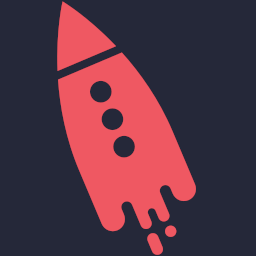
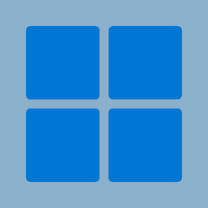

  

<h1><b> Welcome to my github profile </b></h1>

<h2><b> About me </b></h2>

- <b> I am a software developer with a passion for creating and designing innovative solutions. </b> 

- <b> I specialize in developing and maintaining software systems, from the initial planning stages to the final implementation. </b> 

- <b> I have experience in a wide range of programming languages and development frameworks, and I am always eager to learn new technologies and stay current with industry trends. </b> 

- <b> I am a highly motivated, detail-oriented, and results-driven individual who is committed to delivering high-quality work on time and on budget. </b> 

- <b> I am excited to be a part of the dynamic and ever-evolving field of software development, and look forward to connecting with like-minded professionals in the industry. </b> 

---

<h2><b> Tech Stack </b></h2>

<h3><b> Programming Languages </b></h3>

 

  

  

<h3><b> Frameworks </b></h3>

 

  
   

  

<h3><b> Cloud Computing </b></h3>

 

  
   

  

<h3><b> Data storage </b></h3>

 

  
  
   

  

<h3><b> Containerization and Orchestration </b></h3>

 

  
   

  

<h3><b> Stream Processing </b></h3>

 

  
   

  

<h3><b> Operational Systems </b></h3>

 

  
  
   

  

<h3><b> Version Control </b></h3>

 

  
   

  

---

<h2><b> Connect with Me </b></h2>

 

  
  

